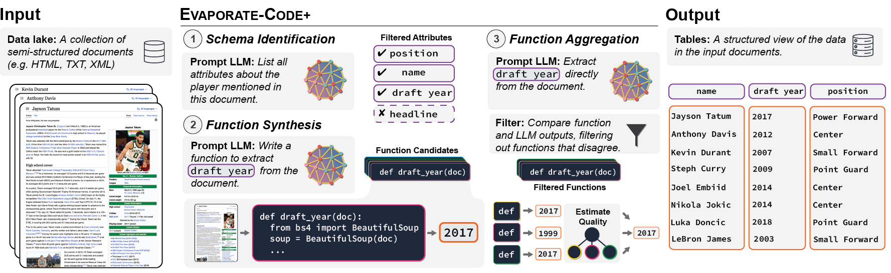

# Evaporate

<div align="center">
    
</div>

Code, datasets, and extended writeup for paper "Language Models Enable Simple Systems for Generating Structured Views of Heterogeneous Data Lakes". 

## Setup

We encourage the use of conda environments:
```bash
#conda create --name evaporate python=3.8
conda create --name evaporate python=3.10
conda activate evaporate
```

Clone as follows:
```bash
# Evaporate code
git clone git@github.com:HazyResearch/evaporate.git
cd ~/evaporate
pip install -e .

# Weak supervision code
cd ~/evaporate/metal-evap
git submodule init
git submodule update
pip install -e .

# Manifest (to install from source, which helps you modify the set of supported models. Otherwise, ``setup.py`` installs ``manifest-ml``)
git clone git@github.com:HazyResearch/manifest.git
cd manifest
pip install -e .
```

## Datasets
The data used in the paper is hosted on Hugging Face's datasets platform: https://huggingface.co/datasets/hazyresearch/evaporate.

To download the datasets, run the following commands in your terminal:
```bash
git lfs install
git clone https://huggingface.co/datasets/hazyresearch/evaporate
```

Or download it via Python:
```python
from datasets import load_dataset
dataset = load_dataset("hazyresearch/evaporate")
```

The code expects the data to be stored at ``/data/evaporate/`` as specified in ``constants.py`` CONSTANTS, though can be modified.


## Running the code
Run closed IE and open IE using the commands:

```cd src/
bash run.sh
```

The ``keys`` in run.sh can be obtained by registering with the LLM provider. For instance, if you want to run inference with the OpenAI API models, create an account [here](https://openai.com/api/).

The script includes commands for both closed and open IE runs. To walk through the code, look at ``run_profiler.py``. For open IE, the code first uses ``schema_identification.py`` to generate a list of attributes for the schema. Next, the code iterates through this list to perform extraction using ``profiler.py``. As functions are generated in ``profiler.py``, ``evaluate_profiler.py`` is used to score the function outputs against the outputs of directly prompting the LM on the sample documents. 


## Extended write-up
The extended write-up is included in this GitHub repository at [this URL](https://github.com/HazyResearch/evaporate/blob/main/technical-report.pdf) and at this link: https://arxiv.org/abs/2304.09433


## Citation
If you use this codebase, or otherwise found our work valuable, please cite:
```
@article{arora2023evaporate,
  title={Language Models Enable Simple Systems for Generating Structured Views of Heterogeneous Data Lakes},
  author={Arora, Simran and Yang, Brandon and Eyuboglu, Sabri and Narayan, Avanika and Hojel, Andrew and Trummer, Immanuel and R\'e, Christopher},
  journal={arXiv:2304.09433},
  year={2023}
}
```
